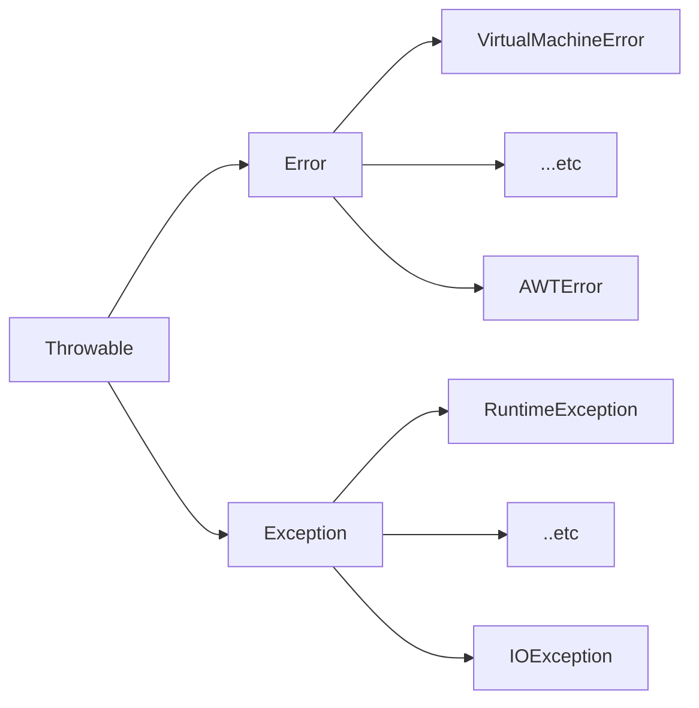

---
tags:
  - java
  - exception
  - class
  - instance
---
> 프로그램 실행시 발생하는 문제들을 처리하기 위한 데이터 타입
# Throwable
> Error과 Exception의 슈퍼 타입.
## Error
> Application 내부에서 처리할 수 없는 문제
## Exception
> Application 내부에서 처리할 수 있는 문제

## Exception Types
> 예외에는 두 종류가 있다.

#### 1. Unchecked Exception
> Error + RuntimeException  
> JVM에 의해 이미 처리되어 있는 예외 클래스
#### 2. Checked Exception
> Exception  - Runtime Exception  
> 반드시 처리해야되는 예외 클래스(안하면 컴파일 에러 발생)

# [[Exception Handling]]
> 예외 처리에는 두 가지 방식이 있다.
1. try-catch
2. throws
# _references_:
1. [_Errors_](https://docs.oracle.com/en/java/javase/17/docs/api/java.base/java/lang/Error.html)
2. [_Unchecked Exceptions_](https://docs.oracle.com/en/java/javase/17/docs/api/java.base/java/lang/Exception.html)
