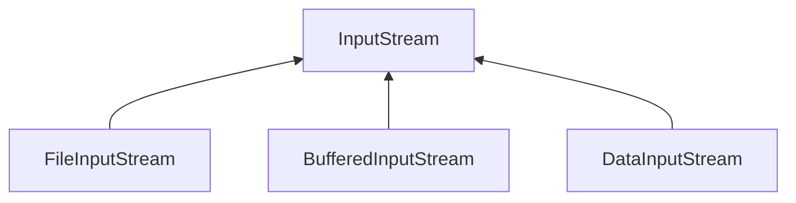
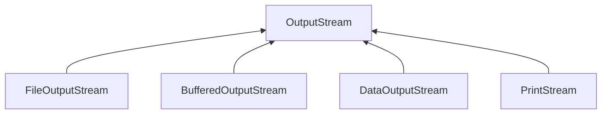
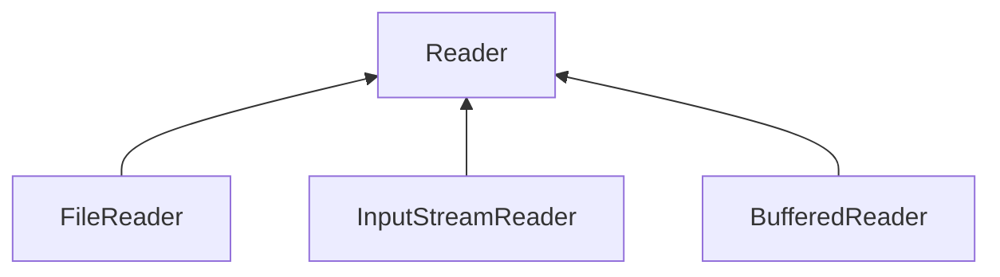
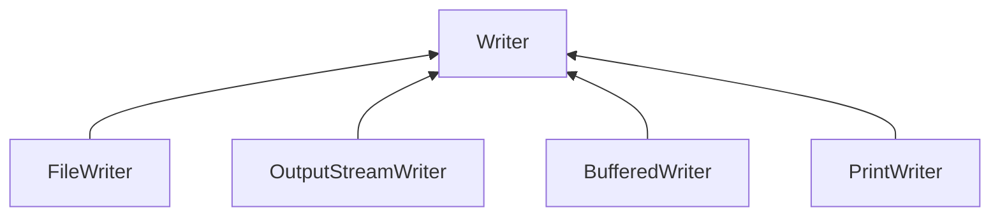

---
tags:
  - java
  - io
  - stream
  - serializable
---
>_**단방향**_  데이터 송수신을 위해 스트림을 활용하여 데이터를 주고 받음

# File
> 파일 시스템의 파일을 다루기 위한 클래스  
> 파일의 크기나 속성, 이름 등의 정보를 확인할 수 있고 파일 생성 및 삭제 기능 등을 제공한다.

# Stream
## Base Stream (기반 스트림)
### Stream
> 입출력 장치에서 데이터를 읽고 쓰기 위한 _**단방향 통로**_  
> 자바에서 제공하는 클래스  
> 1 byte 단위의 데이터만 지나가게 되며 일방통행이라 입력과 출력 스트림을 따로 구성해야 한다.

#### Input Stream

#### Output Stream

# Reader/Writer
> 인코딩 방식에 따라 2,3바이트 단위로 입출력 수행
#### Reader

#### Writer

# Auxilary Stream (보조 스트림)
> 기반 스트림 위에서 추가적으로 기능을 수행하는 스트림

#### Buffered I/O Stream
> 입출력 속도 향상

#### I/OStreamReader
> 인코딩 방식을 고려한 한글 깨짐 방지

#### Data I/O Stream
> 기본 자료형 + 문자열 관련 타입에 따른 메소드 제공

#### Object I/O Stream
> 객체 단위 입출력 (cf. Serializable)

### Transient
> transient 붙은 필드는 무시함