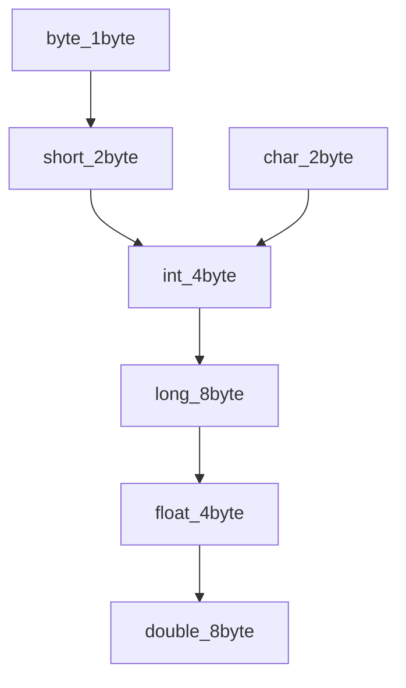

---
tags:
  - java
---
> 변수 또는 리터럴을 다른 타입으로 변환하는 것

# 형 변환 종류 및 규칙
#### 자동 형변환(_Implicit Coercion_)
> 컴파일러가 자동으로 수행해주는 타입 변환이다. 데이터 손실 가능성이 없는 경우 자동으로 타입을 맞춰준다.



1. 작은 자료형에서 큰 자료형으로는 자동으로 형변환 된다.
2. 정수는 실수로 자동 형변환 된다. (실수형은 정수형보다 훨씬 더 많은 값을 표현할 수 있다.)
3. 문자형은 int형으로 자동 형변환 된다.
4. 논리형은 형변환 규칙에서 제외된다. (어느 자료형이든 boolean을 형변환 해서 담을 수 없다.)
5. int와 char은 자동 형변환 된다.

####  강제 형변환
> 형변환 연산자를 이용한 강제적 형변환<br/>
> 자동 형변환의 조건과 정 반대의 경우 강제 형변환을 사용한다.

1. 큰 자료형에서 작은 자료형으로 변경시 강제 형변환이 필요하다. 데이터 손실 가능성 있음
2. 실수를 정수로 변경 시 강제 형변환이 필요하다.
3. 문자형을 int미만 크기의 변수에 저장할 때 강제 형변환이 필요하다.
4. 논리형은 강제 형변환 규칙에서도 제외된다.

```Java
long lNum = 80000000000L; // 80000000000  
System.out.println("lNum = " + lNum);  
int iNum = (int)lNum;  
System.out.println("iNum = " + iNum); // -1604378624  
  
float avg = 31.235f;  
System.out.println("avg = " + avg);  //31.235
int floorNum = (int)avg;  
System.out.println("floorNum = " + floorNum); //31
```

